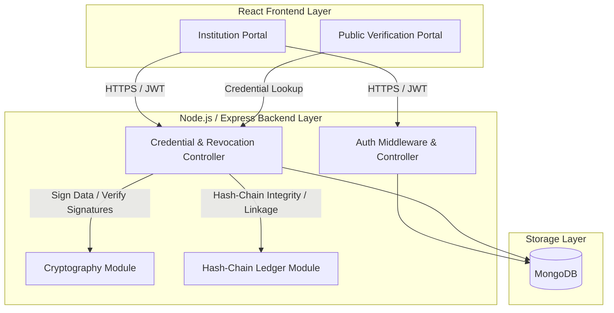
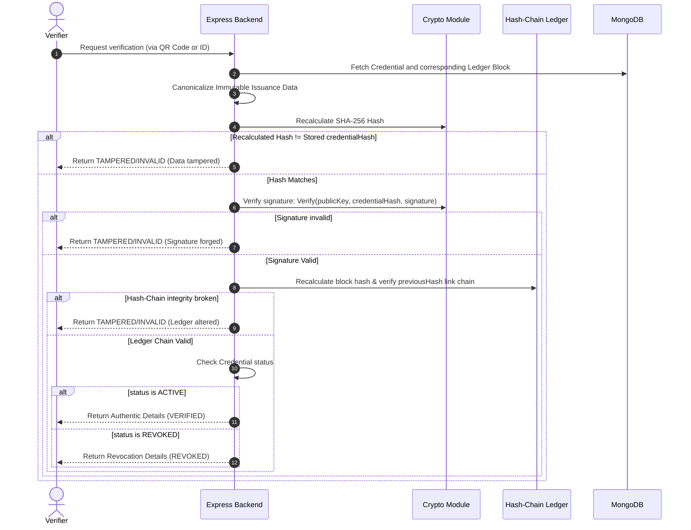

# CertiVault Architecture

This document outlines the architectural blueprint of CertiVault, a single-node tamper-evident credential verification system.

## 1. System Overview

CertiVault provides academic institutions with a secure platform to issue digital credentials and allows third-party verifiers to validate their authenticity instantly via QR code or ID lookup without direct contact with the institution.

Rather than running a decentralized smart contract network, CertiVault leverages a **simplified single-node tamper-evident hash-chain ledger** persisted in MongoDB and implemented as a simplified single-node tamper-evident hash-chain ledger by the backend. and backed by **digital signatures (asymmetric cryptography)**.

---

## 2. Component Layers

### 2.1. Client (React Frontend)
- **Vite & React**: Single Page Application (SPA) offering high performance and responsive interfaces.
- **Tailwind CSS**: Tailored dashboard, verification views, and interactive tamper-demo screens.
- **React Router**: Routing between the Institution Dashboard, Signup/Login, and Public verification pages.
- **Axios**: HTTP client configuration with JWT attachment interceptors.

### 2.2. Server (Node.js & Express)
- **Express.js API**: Exposes endpoints for authentication, issuance, verification, and revocation.
- **Middleware**: JWT authentication verification, API input validation.
- **Cryptographic Service**: A self-contained server-side module executing digital signatures and block hashing using Node.js built-in `crypto` module.
- **Ledger Service**: Handles reading/appending blocks and verifying the integrity of the hash chain.

### 2.3. Storage (MongoDB)

#### Institution Collection
Stores institutional details, hashed credentials (bcrypt for login), public verification keys, and private keys (encrypted at rest using an application-level key).

#### Ledger Collection
Stores the blockchain-inspired blocks. Ledger records are treated as append-only by the application. The system does not claim that MongoDB itself makes records physically immutable; unauthorized modification is detected through cryptographic hash verification.
- **Block Fields**:
  - `index`: Sequential identifier (0 for Genesis block).
  - `timestamp`: Creation time.
  - `credentialId`: Reference to the credential document.
  - `dataHash`: Cryptographic hash of the immutable credential data.
  - `previousHash`: `blockHash` of the preceding block.
  - `signature`: Signature generated over the `dataHash`.
  - `blockHash`: Calculated block hash.

#### Credential Collection
Stores complete academic credentials.
- **Immutable Issuance Data**:
  - `studentName`
  - `studentId`
  - `degree`
  - `department`
  - `graduationDate`
  - `issueDate`
  - `institutionId`
- **Verification Data**:
  - `credentialHash`
  - `signature`
  - `keyId`
- **Current Status Metadata (Mutable)**:
  - `status` (ACTIVE | REVOKED)
  - `revokedAt` (null | Date)
  - `revokedBy` (null | String)
  - `revocationReason` (null | String)

---

## 3. Core Issuance & Verification Logic

### 3.1. Issuance Flow
When an institution issues a new credential, the server:
1. Canonicalizes the **Immutable Issuance Data**.
2. Computes the hash: `credentialHash = SHA256(canonicalImmutableData)`.
3. Creates the digital signature: `signature = Sign(privateKey, credentialHash)`.
4. Creates a new ledger block containing the signature, `credentialHash` as the `dataHash`, and the `previousHash` from the current tail block.
5. Saves the block and the credential (including signature and hash) in MongoDB.

### 3.2. Verification Flow

---

## 4. Key Architectural Rules

1. **Separation of Concerns**: Cryptographic operations (signing, hashing, verification) must be isolated from the database operations and routing logic.
2. **Private Key Protection**:
   - Private keys are stored in MongoDB **encrypted at rest** using an application-level key loaded from backend environment configuration.
   - Private keys are decrypted in memory only when generating a digital signature and are never logged, returned in APIs, or sent to the frontend.
   - Production environments should migrate from env variables to a dedicated KMS/HSM service.
3. **Revocation Boundaries**: Revocation modifies status metadata (`status = REVOKED`) on the credential record but **never** alters the historical, tamper-evident block recorded in the hash-chain ledger.
4. **No False Claims**: All documentation and system interfaces must accurately label the ledger as a **simplified tamper-evident hash-chain ledger**, not a decentralized blockchain.
5. **Hash Input Boundaries**: The credentialHash MUST be computed only from the canonical immutable issuance data. Mutable status/revocation fields MUST NOT participate in credentialHash.
