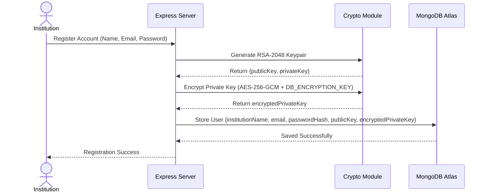
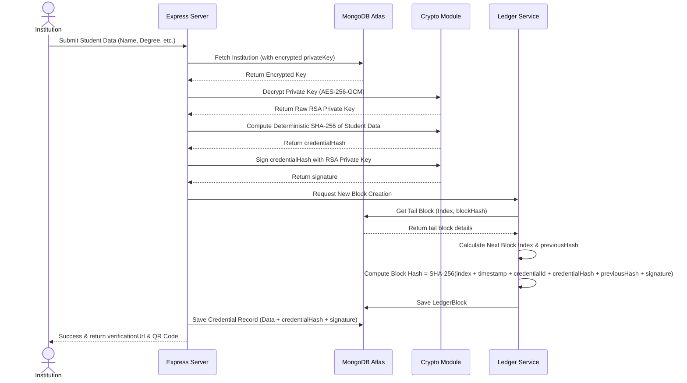
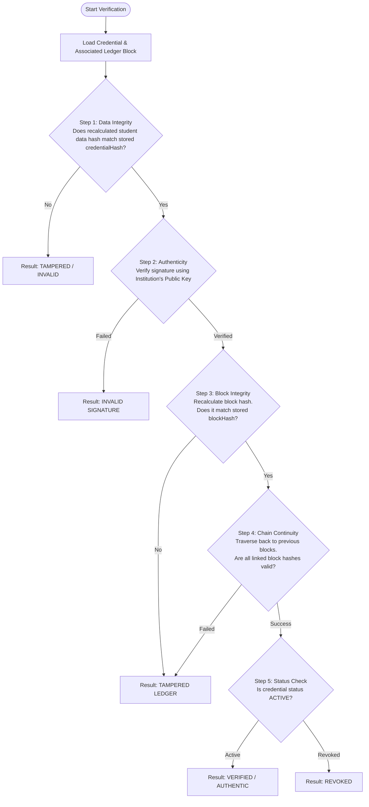

# System Flow: Issuance & Verification

This document details the architectural flows for credential registration, issuance, and cryptographic verification within CertiVault.

---

## 1. Key Generation & Registration Flow

When a new educational institution signs up, the system generates a dedicated cryptographic identity for signing future credentials.

---

## 2. Credential Issuance Flow

To issue a tamper-proof credential, the institution submits the student details. The server constructs the credential and seals it inside a single-node tamper-evident ledger.

---

## 3. Credential Verification Flow

Verification is completely public. When someone scans a QR code or queries a credential ID, the system performs a 5-step integrity audit.

### Verification Steps Explanation:

1. **Data Integrity Audit**: Re-serializes the JSON student data deterministically and recalculates its SHA-256 hash. If even one character of the name or degree was altered directly in the database, this recalculation fails.
2. **Signature Verification**: Validates the cryptographic signature using the institution's public key to confirm that the credential was signed by the registered institution and hasn't been altered.
3. **Block Verification**: Recomputes the SHA-256 hash of the corresponding block's properties inside the ledger (`index`, `timestamp`, `credentialId`, `dataHash`, `previousHash`, `signature`) and asserts it matches the database `blockHash`.
4. **Chain Verification**: Verifies the ledger sequence. Starting from the target block, the system crawls backwards, ensuring each block's `previousHash` matches the actual block hash of the preceding record, guaranteeing historical immutability.
5. **Status Verification**: Checks whether the document has been marked as `REVOKED` in the database.
